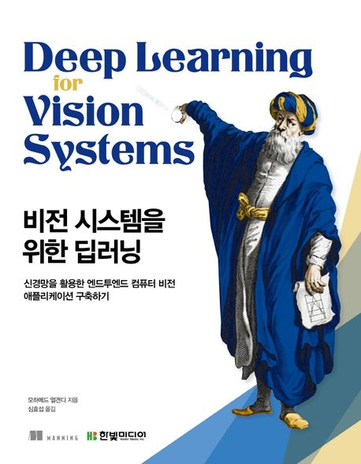

  
<h1 align="center">
  
살아 움직이는 머신러닝 파이프라인 설계

  
</h1>
  
<b>모하메드 엘겐디 저 · 심효섭 역</b> 
한빛미디어 · 2021년 12월 20일 출시 
[[errata](https://www.hanbit.co.kr/store/books/look.php?p_code=B6566099029)]</b> 

## :bulb: 목표

- **딥러닝 컴퓨터 비전을 공부한다.**

  > 다양한 비전 신경망 모델을 파악하고 효과적인 학습법을 익힌다.

 

## :mag: 목차

### [PART I 딥러닝 기초]

#### CHAPTER 1 컴퓨터 비전 입문

    1.1 컴퓨터 비전
    1.2 컴퓨터 비전 응용 분야
    1.3 컴퓨터 비전 파이프라인 전체 처리 과정
    1.4 이미지 입력
    1.5 이미지 전처리
    1.6 특징 추출
    1.7 분류 학습 알고리즘
    1.8 마치며

#### CHAPTER 2 딥러닝과 신경망

    2.1 퍼셉트론
    2.2 다층 퍼셉트론
    2.3 활성화 함수
    2.4 순방향 계산
    2.5 오차 함수
    2.6 최적화 알고리즘
    2.7 역전파 알고리즘
    2.8 마치며

#### CHAPTER 3 합성곱 신경망

    3.1 다층 퍼셉트론을 이용한 이미지 분류
    3.2 합성곱 신경망 구조
    3.3 합성곱 신경망의 기본 요소
    3.4 CNN을 이용한 이미지 분류
    3.5 과적합을 방지하기 위해 드롭아웃층 추가하기
    3.6 컬러 이미지의 합성곱 연산(3D 이미지)
    3.7 프로젝트: 컬러 이미지 분류 문제
    3.8 마치며

#### CHAPTER 4 딥러닝 프로젝트 시동 걸기와 하이퍼파라미터 튜닝

    4.1 성능 지표란
    4.2 베이스라인 모델 설정하기
    4.3 학습 데이터 준비하기
    4.4 모델을 평가하고 성능 지표 해석하기
    4.5 신경망을 개선하고 하이퍼파라미터 튜닝하기
    4.6 학습 및 최적화
    4.7 최적화 알고리즘
    4.8 과적합을 방지하기 위한 규제화 기법
    4.9 배치 정규화
    4.10 프로젝트: 이미지 분류 정확도 개선하기
    4.11 마치며

### [PART II 이미지 분류와 탐지]

#### CHAPTER 5 고급 합성곱 신경망 구조

    5.1 CNN의 디자인 패턴
    5.2 LeNet-5
    5.3 AlexNet
    5.4 VGGNet
    5.5 인셉션과 GoogLeNet
    5.6 ResNet
    5.7 마치며

#### CHAPTER 6 전이학습

    6.1 전이학습으로 해결할 수 있는 문제
    6.2 전이학습이란
    6.3 전이학습의 원리
    6.4 전이학습의 세 가지 방식
    6.5 적합한 전이학습 수준 선택하기
    6.6 오픈 소스 데이터셋
    6.7 프로젝트 1: 사전 학습된 신경망을 특징 추출기로 사용하기
    6.8 프로젝트 2: 미세 조정
    6.9 마치며

#### CHAPTER 7 R-CNN, SSD, YOLO를 이용한 사물 탐지

    7.1 사물 탐지 알고리즘의 일반적인 프레임워크
    7.2 영역 기반 합성곱 신경망
    7.3 싱글샷 탐지기
    7.4 YOLO
    7.5 프로젝트: 자율주행차를 위한 싱글샷 탐지기 학습하기
    7.6 마치며

### [PART III 생성 모델과 시각 임베딩]

#### CHAPTER 8 생성적 적대 신경망

    8.1 GAN 구조
    8.2 GAN 모델의 평가 방법
    8.3 GAN 응용 분야
    8.4 프로젝트: GAN 모델 직접 구현해보기
    8.5 마치며

#### CHAPTER 9 딥드림과 신경 스타일 전이

    9.1 합성곱 신경망이 본 세계는 어떤 것일까
    9.2 딥드림
    9.3 신경 스타일 전이
    9.4 마치며

#### CHAPTER 10 시각 임베딩

    10.1 시각 임베딩 응용 분야
    10.2 임베딩 학습하기
    10.3 손실 함수
    10.4 정보량이 높은 데이터를 골라내는 마이닝
    10.5 프로젝트: 임베딩 신경망 학습하기
    10.6 현재 성능 더욱 끌어올리기
    10.7 마치며
    10.8 참고 문헌

### APPENDIX A 실습 환경 설정하기

    A.1 코드 저장소 내려받기
    A.2 아나콘다 설치하기
    A.3 딥러닝 실습 환경 설정하기
    A.4 AWS EC2 환경 설정하기