# 4 신경망 평가와 하이퍼파라미터 튜닝 (Part II)

> [epoch, batch, mini-batch 개념 정리](https://github.com/erectbranch/Neural_Networks_and_Deep_Learning/tree/master/ch03/summary02): 3.6.4절 참조

---

## 4.6 batch size, gradient descent

batch size는 특히 GPU 자원과 학습 속도에 큰 영향을 미치는 하이퍼파라미터다.

> 2,000개 이하의 작은 데이터셋이 아니면 batch size는 32, 64, 128, 256, 512 등 2의 배수로 늘려가면서 실험해보는 것이 좋다.

우선 mini-batch를 사용하지 않을 때의 경사 하강법을 보자.

- **Batch Gradient Descent**(BGD)

    훈련 데이터셋 전체를 입력 한 번에 모두 사용한다. 즉, <U>가중치 갱신이 1 epoch에 단 한 번 일어난다.</U>(그만큼 시간은 오래 걸린다.)

    따라서 optimal까지 큰 보폭으로 접근할 수 있고 노이즈도 적다. 하지만 그만큼 학습 속도가 느리고 메모리 사용량이 크다.

    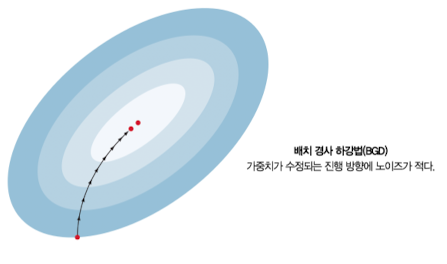

- **Stochastic Gradient Descent**(SGD)

    훈련 데이터셋에서 임의의 한 데이터를 뽑아 입력으로 사용한다. 즉, <U>가중치 갱신이 해당 데이터마다 일어난다.</U>

    > 많은 데이터를 병렬로 처리하는 이점을 보기 어렵다.

    따라서 진동이 심하고 간혹 엉뚱한 방향으로 나아간다. 주로 lr을 감소시켜 이러한 현상을 억제하는데, BGD보다 대체로 좋은 성능을 보인다.

반면 mini-batch를 사용하며 BGD, SGD의 중간 정도의 성격을 갖는 방법도 있다.

- **Mini-Batch Gradient Descent**(MB-GD)

    <U>가중치 갱신이 mini-batch마다 일어난다.</U>

---

## 4.7 learning rate 조절하기

> 요슈아 벤지오: 학습률은 가장 중요한 하이퍼파라미터로, 항상 잘 조절되어 있어야 한다. 단 하나의 하이퍼파라미터를 조정할 시간밖에 주어지지 않는다면 학습률을 조절해야 한다.

**learning rate**(학습률)은 최적화 알고리즘 설정에서 loss function의 경사를 어느 정도 보폭으로 내려갈지 결정하는 파라미터다.

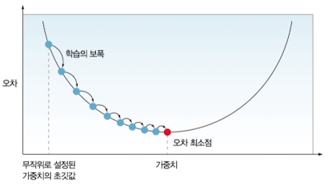

- 임의의 점을 초깃값으로 시작하여 최적 weight를 찾아간다.

- 1 epoch마다 설정한 보폭만큼 경사를 내려간다.

그렇다면 learning rate를 완벽하게 설정한다면, 한 번에 optimal에 도달할 수 있지 않을까? 이러한 learning rate를 **ideal lr value**(이상적 학습률)이라고 해보자.

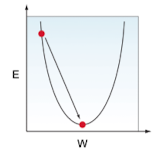

하지만 실제로 이러한 이상적인 경우를 알 수는 없다. 결국 시행착오가 필요한데, ideal lr을 기준으로 lr이 큰지, 작은지에 따라서 다음과 같이 학습이 진행된다.

- lr < ideal lr

    수렴이 느리긴 하나 optimal에 도달할 수 있다.

    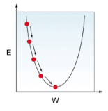

- lr > ideal lr

    optimal을 지나쳐버린다.

    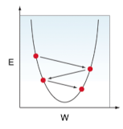

- lr >>> ldeal lr

    optimal을 지나쳐버리는 것을 넘어 오히려 멀어지게 된다. 이러한 현상을 **divergence**(발산)이라고 한다.

    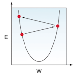

learning rate에 따른 loss 차이를 그래프 하나로 표현하면 다음과 같다.

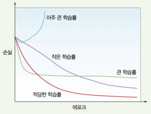

---

### 4.7.1 최적의 learning rate를 설정하는 법

최적의 성능을 얻기 위해서는 learning rate를 0.1, 0.01, 0.001, 0.00001 등으로 조절하며 성능과 학습 시간을 관찰할 필요가 있다.

이때 validation loss 추이를 보면서 learning rate 조절의 힌트를 얻을 수 있다.

- 파라미터를 바꿨을 때 val_loss가 감소: 정상

- 학습이 끝났지만 val_loss가 여전히 감소: **비정상**

  → 두 가지 해결책을 사용해 볼 수 있다.

  - lr은 그대로 두고 epoch을 늘린다.

  - lr을 늘려서 학습을 다시 시작한다.

- val_loss가 증감을 반복(진동): 비정상

  → lr이 너무 크면 발생한다. lr을 줄여서 학습한다.

  예시를 보자. 첫 5 epoch은 train_loss, val_loss가 함께 감소한다.

    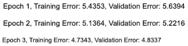

  하지만 8 epoch을 보면 train_loss는 감소하나 val_loss는 진동한다.

    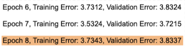

  > 학습이 충분히 된 경우 **early stopping**(조기 종료)를 고려할 수 있다.

---

### 4.7.2 learning rate decay

그러나 고정된 lr을 사용하지 않고 변화하는 lr을 사용하는 방법도 있다. 이러한 방법을 **learning rate decay**(학습률 감쇠)라고 한다.

학습 초반에 큰 lr을 사용하고, 학습이 진행될수록 lr을 감소시킨다. 이를 잘 활용하면 학습 시간을 줄이면서도 optimal을 놓치지 않을 수 있다.

---

#### 4.7.2.1 step decay

대표적으로 일정 비율로 lr을 감소시키는 **step decay**(계단형 감쇠)가 있다.

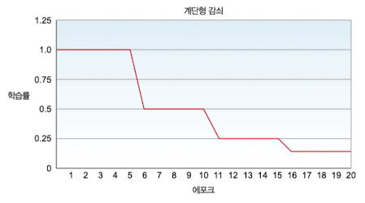

- 5 epoch마다 lr을 1/2배 감소시켰다.

---

#### 4.7.2.2 exponential decay

**exponential decay**(지수 감쇠)는 lr을 지수적으로 감소시킨다.

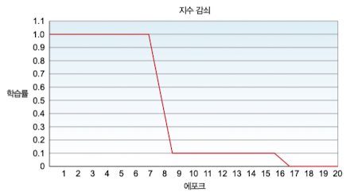

- 8 epoch마다 lr을 1/10배 감소시켰다.

  > step decay 예시보다 더 빠르게 lr을 감소시켰으므로 학습 시간은 더 오래 걸릴 것이다.

---

#### 4.7.2.3 momentum

SGD은 특성상 optimal로 향하는 과정에서 진동이 생겼다. 이러한 진동이 학습 시간을 늘리거나 발산시키는 문제로 작용할 수 있기 때문에, 진동을 감소시키기 위한 방법으로 **momentum**(모멘텀)이 등장했다.

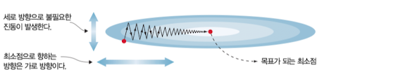

- 세로 방향으로는 학습을 느리게 진행한다.

- 가로 방향으로는 학습을 빠르게 진행한다.

가중치 갱신항에 속도항이 추가되는데, 속도항은 이전에 계산한 경사의 가중 평균이다.

---

#### 4.7.2.5 Adam

Adam은 **adaptive moment estimate**(적응형 모멘트 예측)의 약자다. 마찬가지로 경사의 평균을 속도항으로 사용하지만, 속도항이 지수적으로 감쇠된다.

---

## 4.8 train_loss > val_loss

> [Your validation loss is lower than your training loss? This is why!](https://towardsdatascience.com/what-your-validation-loss-is-lower-than-your-training-loss-this-is-why-5e92e0b1747e)

간혹 학습 중 train_loss보다 val_loss가 낮은 경우를 발견한다. 이런 일이 발생할 수 있는 몇 가지 원인이 있다.

> 보통 학습 데이터셋으로 훈련을 하므로, 훈련 데이터셋을 더 잘 예측할 것이라고 생각한다.

---

### 4.8.1 L1, L2 regularization

overfitting을 방지하기 위해 종종 사용하는 기법인 L1, L2 regularization이 문제일 수 있다.

- regularization terms(정칙화 항)은 <U>오직 훈련 중에만 적용되며 train loss를 부풀리게 된다.</U> 

비교를 위해 L1 Loss, L2 loss, Validation Loss를 비교해 보자.

$$ L1 \, loss = train \, set \, prediction \, error + \lambda \sum_{i=1}^{n}{|{\beta}_{i}|} $$

$$ L2 \, loss = train \, set \, prediction \, error + \lambda \sum_{i=1}^{n}{{\beta}_{i}}^{2} $$

$$ Validation \, loss = validation \, set \, prediction \, error $$

따라서 이 경우 val_loss가 train_loss보다 일반적으로 낮을 수밖에 없다.

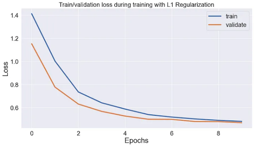

> 실제로 학습 데이터셋과 검증 데이터셋을 이용해 정확도를 측정해 보면, 학습 데이터셋에서 더 정확도가 높을 것이다.

---

### 4.8.2 Dropout

마찬가지로 overfitting을 방지하는 **dropout** 기법이 원인일 수 있다.

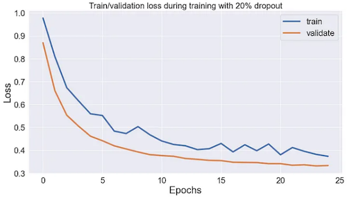

---

### 4.8.3 단순한 우연

단순히 아직 가중치 갱신이 덜 된 첫 몇 epoch동안 우연히 발생할 수도 있다.

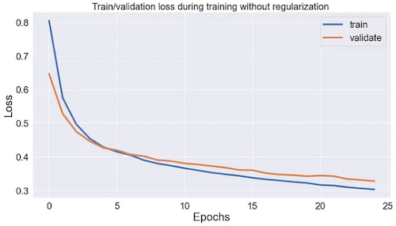

혹은 학습/검증/테스트 데이터셋을 나누는 과정에서, 학습 데이터셋이 특히 노이즈가 많은 데이터를 가지고 있을 수 있다.

- `train_test_split` 함수의 random seed를 변경하여 처리할 수 있다.

> 자주 간과하지만 random seed는 결과에 큰 영향을 미칠 수 있다.

---